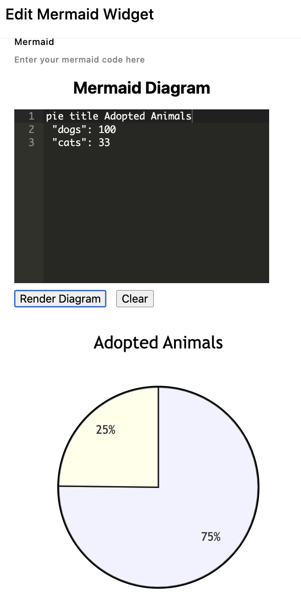

<h1>Mermaid Diagrams For ApostropheCMS</h1>
<p>
  <a aria-label="Apostrophe logo" href="https://v3.docs.apostrophecms.org">
      
  </a>
  <a aria-label="License" href="https://github.com/apostrophecms/module-template/blob/main/LICENSE.md">
    
  </a>
</p>

This module adds the Mermaid Diagram package for use in an [ApostropheCMS](https://apostrophecms.com/) project. This package allows for the addition of several different diagrams as outlined in the [Mermaid documentation](https://mermaid.js.org).

## Installation

To install the module, use the command line to run this command in an Apostrophe project's root directory:

```
npm install @bodonkey/mermaid-extension
```

## Usage

Add the mermaid-extension bundle and widget module in the `app.js` file:

```javascript
require('apostrophe')({
  shortName: 'my-project',
  bundles: [ '@bodonkey/mermaid-extension' ],
  modules: {
    'mermaid-widget': {}
  }
});
```

The widget can then be added to any area in the `widgets` property.

```javascript
//...
fields: {
    add: {
      main: {
        type: 'area',
        options: {
          widgets: {
            '@apostrophecms/rich-text': {},
            '@apostrophecms/image': {},
            '@apostrophecms/video': {},
            'mermaid': {}
          }
        }
      }
    }
//...
```



Selecting the mermaid widget in an area will bring up a modal containing a code editor for you to input the code for your diagram. After adding code you can test the results by clicking the 'Render Diagram' button. Note that the width of the modal prevents the display of the legend in the preview.

You can customize your diagrams by passing configuration in the diagram front matter. For example:

```
---
title: Hello Title
config:
  theme: base
  themeVariables:
    primaryColor: "#00ff00"
---
flowchart
	Hello --> World
```

You can read more about configuration options in the [Mermaid documentation](https://mermaid.js.org/config/configuration.html).
