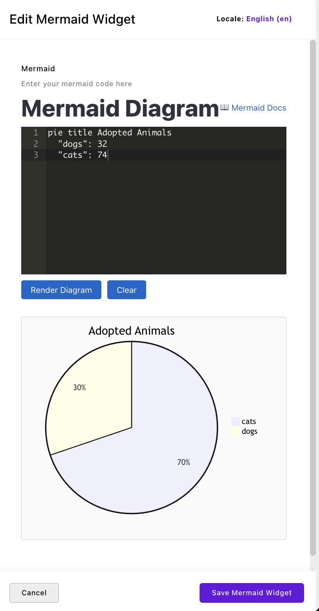
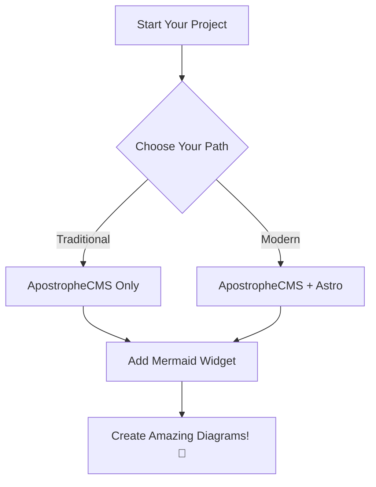
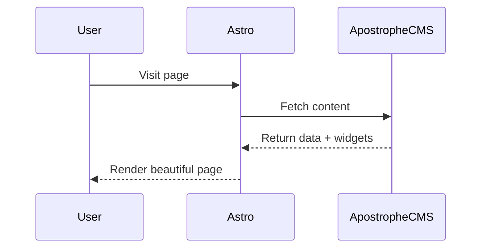
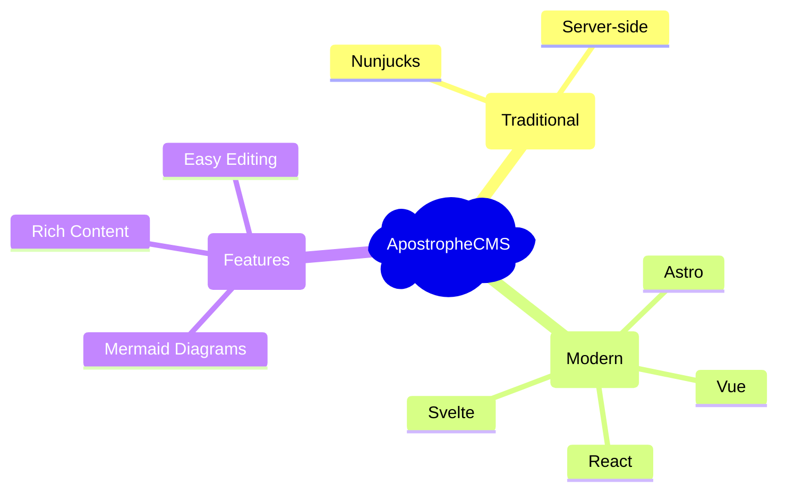
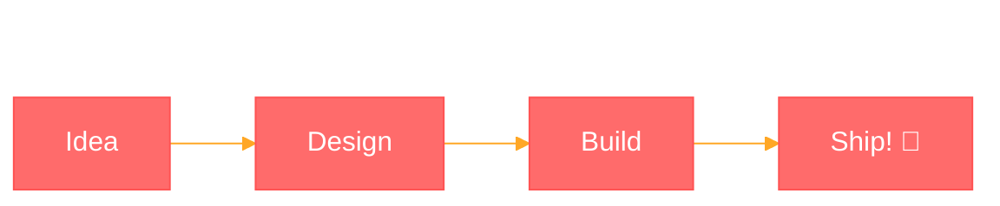

# 🧜‍♀️ Mermaid Diagrams for ApostropheCMS + Astro

<div align="center">
  
  
  
</div>

> Transform your content with beautiful, interactive diagrams! From flowcharts to mind maps, this module brings the power of [Mermaid](https://mermaid.js.org) to your ApostropheCMS projects with seamless Astro frontend support.

## ✨ What You Get

🎨 **Visual Storytelling** - Turn complex ideas into clear, beautiful diagrams  
⚡ **Real-time Preview** - See your diagrams render as you type  
🎯 **Full Editor Experience** - Syntax highlighting with Ace Editor  
🌊 **Astro Integration** - Works perfectly with modern Astro frontends  
🎨 **Themeable** - Customize colors, styles, and themes  
📱 **Responsive** - Diagrams look great on any device  

## 🚀 Quick Start

### For Traditional ApostropheCMS Projects

```bash
npm install @bodonkey/mermaid-extension
```

```javascript
// app.js
import apostrophe from 'apostrophe';

apostrophe ({
  root: import.meta,
  shortName: 'my-project',
  bundles: [ '@bodonkey/mermaid-extension' ],
  modules: {
    'mermaid-widget': {
      options: {
        initBlock: '%%{init: { "theme": "base" }}%%'
      }
    }
  }
});
```

### For Astro + ApostropheCMS Projects
Follow all the steps to install in the `backend` folder like a traditional project. Then in the `frontend`

**Frontend (Astro):**
```bash
npm install @bodonkey/mermaid-extension
```

```javascript
// src/widgets/index.js
import MermaidWidget from '@bodonkey/mermaid-extension/astro/MermaidWidget.astro';

const widgetComponents = {
  'mermaid': MermaidWidget,
  // ... your other widgets
};

export default widgetComponents;
```

**Required: register the integration.** Diagram rendering runs from a script that must load once, on every page — add the integration in `astro.config.mjs`:

```javascript
// astro.config.mjs
import { defineConfig } from 'astro/config';
import mermaidWidget from '@bodonkey/mermaid-extension/astro/integration';

export default defineConfig({
  integrations: [ mermaidWidget() ]
  // ...your other config
});
```

> **Why this is required:** ApostropheCMS's in-context editor inserts and refreshes widget markup by setting `element.innerHTML`. Browsers never execute `<script>` tags inserted that way, so a mermaid diagram added or edited in the editor would render only after a hard page reload. The integration injects the render script as part of Astro's normal page bundle instead of inline widget markup, so it's already loaded — and already listening for Apostrophe's `refreshed` event — before the editor ever touches the DOM. Without this integration, diagrams inserted via the in-context editor will not render until a full page reload.

For Astro frontends, pass the same shared init block through a small wrapper component:

```astro
---
import MermaidWidget from '@bodonkey/mermaid-extension/astro/MermaidWidget.astro';

const initBlock = '%%{init: { "theme": "base" }}%%';
---

<MermaidWidget {...Astro.props} initBlock={initBlock} />
```

Then map your wrapper component in `src/widgets/index.js`.
## 🛠️ Usage

Add the widget to any area in your page or piece types:

```javascript
fields: {
  add: {
    main: {
      type: 'area',
      options: {
        widgets: {
          '@apostrophecms/rich-text': {},
          '@apostrophecms/image': {},
          'mermaid': {}  // 🎉 Your new diagram widget!
        }
      }
    }
  }
}
```

### 📊 Creating Diagrams

Selecting the mermaid widget in an area will bring up a modal containing a code editor for you to input the code for your diagram. You can also add an optional caption, which renders as a `<figcaption>`. After adding code you can test the results by clicking the 'Render Diagram' button. Note that the width of the modal prevents the display of the legend in the preview.

Rendered diagrams use semantic figure markup:

```html
<figure class="mermaid-widget">
  <div class="mermaid-widget__canvas">
    <!-- rendered SVG -->
  </div>
  <figcaption class="mermaid-widget__caption">Optional caption</figcaption>
</figure>
```

#### Upgrade note

If you styled earlier versions with selectors like `[data-mermaid-widget] > .mermaid`, update those selectors to use `.mermaid-widget`, `.mermaid-widget__canvas`, or `.mermaid-widget__caption`.

**Astro projects:** as of this release, `MermaidWidget.astro` no longer contains its own inline render script. You must add the `mermaidWidget()` integration to `astro.config.mjs` (see the Astro setup above) or diagrams will stop rendering entirely. This is a required step, not an optional one.

### 🎨 What Can You Create?

#### Flowcharts

```mermaid
flowchart TD
    A[Start Your Project] --> B{Choose Your Path}
    B -->|Traditional| C[ApostropheCMS Only]
    B -->|Modern| D[ApostropheCMS + Astro]
    C --> E[Add Mermaid Widget]
    D --> E
    E --> F[Create Amazing Diagrams! 🎉]
```

#### Sequence Diagrams

```mermaid
sequenceDiagram
    participant User
    participant Astro
    participant ApostropheCMS
    
    User->>Astro: Visit page
    Astro->>ApostropheCMS: Fetch content
    ApostropheCMS-->>Astro: Return data + widgets
    Astro-->>User: Render beautiful page
```

#### Mind Maps

```mermaid
mindmap
  root)ApostropheCMS(
    (Traditional)
      Nunjucks
      Server-side
    (Modern)
      Astro
      React
      Vue
      Svelte
    (Features)
      Mermaid Diagrams
      Rich Content
      Easy Editing
```

#### And So Much More!
- 📊 **Pie Charts** - Perfect for data visualization
- 🗺️ **User Journey Maps** - Map out user experiences  
- 📈 **Gantt Charts** - Project timelines made easy
- 🏗️ **Architecture Diagrams** - System design visualization
- 🌳 **Git Graphs** - Show branching strategies

You can read more about diagram types in the [Mermaid documentation](https://mermaid.js.org).

## 🎨 Customization Magic

Make your diagrams uniquely yours with custom themes:


```mermaid
---
title: My Beautiful Flowchart
config:
  theme: base
  themeVariables:
    primaryColor: "#ff6b6b"
    primaryTextColor: "#ffffff"
    primaryBorderColor: "#ff5252"
    lineColor: "#ffa726"
---
flowchart LR
    A[Idea] --> B[Design]
    B --> C[Build]
    C --> D[Ship! 🚀]
```
You can read more about configuration options in the [Mermaid documentation](https://mermaid.js.org).

### Shared Mermaid Init

Set `initBlock` on the `mermaid-widget` module to apply the same Mermaid directive to every diagram. The directive is prepended only while rendering, so editors do not have to repeat it in every widget.

```javascript
'mermaid-widget': {
  options: {
    initBlock: `%%{init: {
      "theme": "base",
      "themeVariables": {
        "primaryColor": "#6516dd",
        "primaryTextColor": "#ffffff"
      }
    }}%%`
  }
}
```

If a diagram starts with its own Mermaid directive (`%%{...}%%`) or YAML frontmatter (`---`), that diagram keeps its own configuration.

## 🌟 Pro Tips

1. **Preview First** - Use the "Render Diagram" button to test your syntax
2. **Start Simple** - Begin with basic flowcharts, then explore advanced features
3. **Theme Consistently** - Use the same color scheme across your diagrams
4. **Mobile-Friendly** - Test how your diagrams look on different screen sizes
5. **Documentation** - Keep the [Mermaid docs](https://mermaid.js.org) handy for reference (or you can open it from the link in the editor).

## 🤝 Contributing

Found a bug? Have an idea for improvement? We'd love to hear from you!

1. **Issues** - Report bugs or request features
2. **Pull Requests** - Contribute code improvements
3. **Documentation** - Help improve these docs
4. **Examples** - Share cool diagram examples

## 📚 Learn More

- [Mermaid Documentation](https://mermaid.js.org) - Complete diagram syntax reference
- [ApostropheCMS Docs](https://docs.apostrophecms.org) - Learn more about the CMS
- [Astro Docs](https://docs.astro.build) - Modern frontend framework

## 📄 License

MIT License - Use it anywhere, build amazing things!

---

<div align="center">
  <strong>Ready to make your content more visual and engaging?</strong><br>
  <code>npm install @bodonkey/mermaid-extension</code><br>
  🐴 Made with hoofy tip-taps by BoDonkey.<br>
  If you find this module helpful, please consider giving it a ⭐ on <a href="https://github.com/BoDonkey/mermaid-extension">GitHub!</a>
</div>
