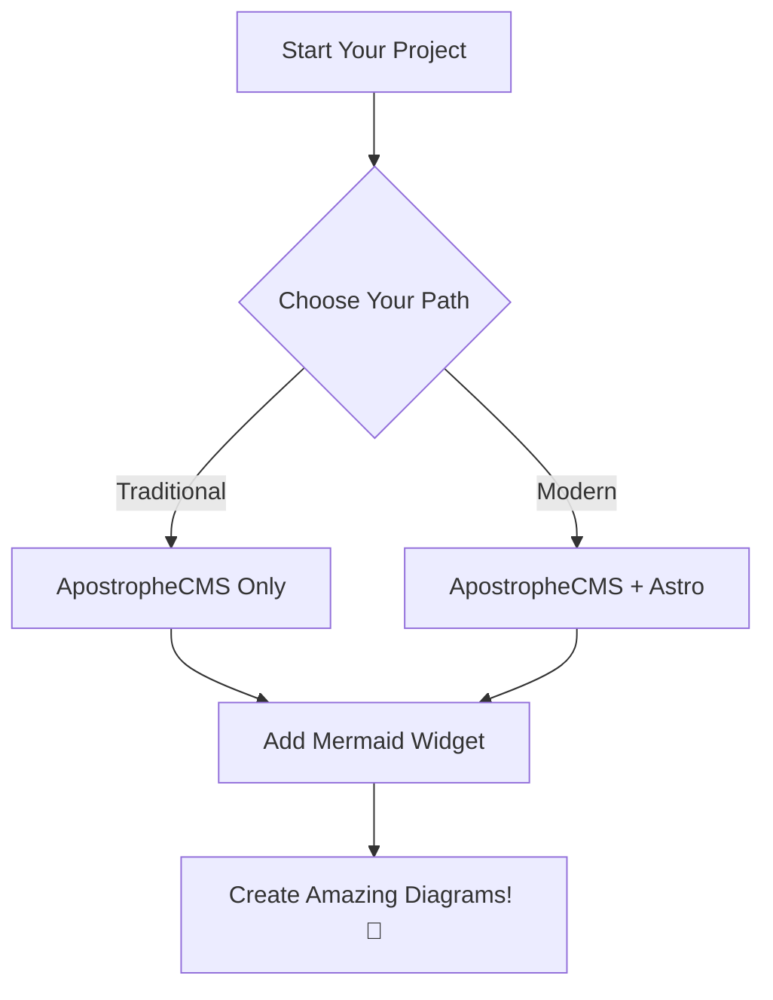
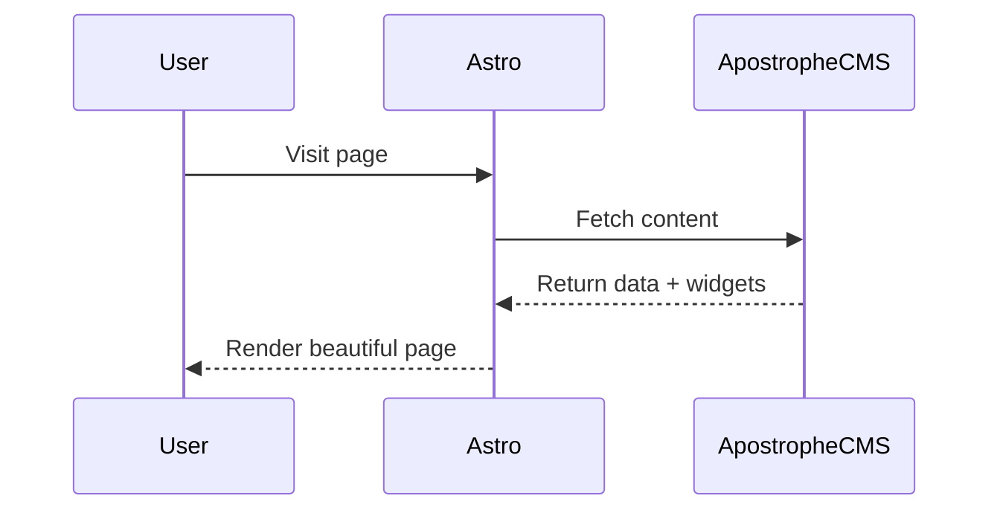
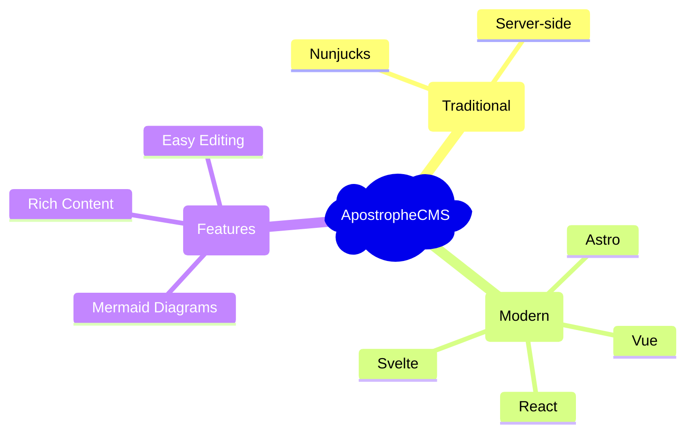
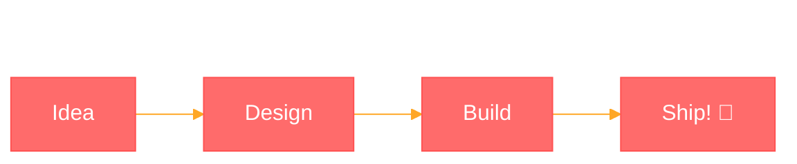

# 🧜‍♀️ Mermaid Diagrams for ApostropheCMS + Astro

<div align="center">
  
  
  
</div>

> Transform your content with beautiful, interactive diagrams! From flowcharts to mind maps, this module brings the power of [Mermaid](https://mermaid.js.org) to your ApostropheCMS projects with seamless Astro frontend support.

## ✨ What You Get

🎨 **Visual Storytelling** - Turn complex ideas into clear, beautiful diagrams  
⚡ **Real-time Preview** - See your diagrams render as you type  
🎯 **Full Editor Experience** - Syntax highlighting with Ace Editor  
🌊 **Astro Integration** - Works perfectly with modern Astro frontends  
🎨 **Themeable** - Customize colors, styles, and themes  
📱 **Responsive** - Diagrams look great on any device  

## 🚀 Quick Start

### For Traditional ApostropheCMS Projects

```bash
npm install @bodonkey/mermaid-extension
```

```javascript
// app.js
import apostrophe from 'apostrophe';

apostrophe ({
  root: import.meta,
  shortName: 'my-project',
  bundles: [ '@bodonkey/mermaid-extension' ],
  modules: {
    'mermaid-widget': {}
  }
});
```

### For Astro + ApostropheCMS Projects

**Backend (ApostropheCMS):**
```bash
npm install @bodonkey/mermaid-extension
```

**Frontend (Astro):**
```bash
npm install @bodonkey/mermaid-extension
```

```javascript
// src/widgets/index.js
import { MermaidWidget } from '@bodonkey/mermaid-extension/astro';

const widgetComponents = {
  'mermaid': MermaidWidget,
  // ... your other widgets
};

export default widgetComponents;
```

## 🎨 What Can You Create?

### Flowcharts

```mermaid
flowchart TD
    A[Start Your Project] --> B{Choose Your Path}
    B -->|Traditional| C[ApostropheCMS Only]
    B -->|Modern| D[ApostropheCMS + Astro]
    C --> E[Add Mermaid Widget]
    D --> E
    E --> F[Create Amazing Diagrams! 🎉]
```

### Sequence Diagrams

```mermaid
sequenceDiagram
    participant User
    participant Astro
    participant ApostropheCMS
    
    User->>Astro: Visit page
    Astro->>ApostropheCMS: Fetch content
    ApostropheCMS-->>Astro: Return data + widgets
    Astro-->>User: Render beautiful page
```

### Mind Maps

```mermaid
mindmap
  root)ApostropheCMS(
    (Traditional)
      Nunjucks
      Server-side
    (Modern)
      Astro
      React
      Vue
      Svelte
    (Features)
      Mermaid Diagrams
      Rich Content
      Easy Editing
```

### And So Much More!
- 📊 **Pie Charts** - Perfect for data visualization
- 🗺️ **User Journey Maps** - Map out user experiences  
- 📈 **Gantt Charts** - Project timelines made easy
- 🏗️ **Architecture Diagrams** - System design visualization
- 🌳 **Git Graphs** - Show branching strategies

## 🛠️ Usage

Add the widget to any area in your page or piece types:

```javascript
fields: {
  add: {
    main: {
      type: 'area',
      options: {
        widgets: {
          '@apostrophecms/rich-text': {},
          '@apostrophecms/image': {},
          'mermaid': {}  // 🎉 Your new diagram widget!
        }
      }
    }
  }
}
```

## 🎨 Customization Magic

Make your diagrams uniquely yours with custom themes:


```mermaid
---
title: My Beautiful Flowchart
config:
  theme: base
  themeVariables:
    primaryColor: "#ff6b6b"
    primaryTextColor: "#ffffff"
    primaryBorderColor: "#ff5252"
    lineColor: "#ffa726"
---
flowchart LR
    A[Idea] --> B[Design]
    B --> C[Build]
    C --> D[Ship! 🚀]
```

## 🌟 Pro Tips

1. **Preview First** - Use the "Render Diagram" button to test your syntax
2. **Start Simple** - Begin with basic flowcharts, then explore advanced features
3. **Theme Consistently** - Use the same color scheme across your diagrams
4. **Mobile-Friendly** - Test how your diagrams look on different screen sizes
5. **Documentation** - Keep the [Mermaid docs](https://mermaid.js.org) handy for reference

## 🔧 Astro Integration Details

The Astro component handles:
- ✅ Server-side rendering compatibility
- ✅ Dynamic imports for optimal performance  
- ✅ Error handling for malformed diagrams
- ✅ Placeholder support for empty widgets
- ✅ Hot reloading during development

## 🤝 Contributing

Found a bug? Have an idea for improvement? We'd love to hear from you!

1. **Issues** - Report bugs or request features
2. **Pull Requests** - Contribute code improvements
3. **Documentation** - Help improve these docs
4. **Examples** - Share cool diagram examples

## 📚 Learn More

- [Mermaid Documentation](https://mermaid.js.org) - Complete diagram syntax reference
- [ApostropheCMS Docs](https://v3.docs.apostrophecms.org) - Learn more about the CMS
- [Astro Docs](https://docs.astro.build) - Modern frontend framework
- [Demo Gallery](#) - See real examples in action

## 📄 License

MIT License - Use it anywhere, build amazing things! 

---

<div align="center">
  <strong>Ready to make your content more visual and engaging?</strong><br>
  <code>npm install @bodonkey/mermaid-extension</code>
</div>